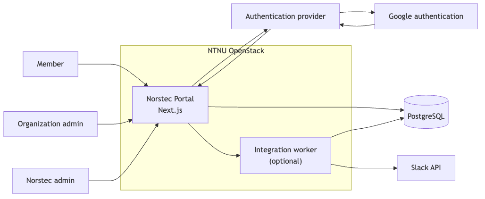
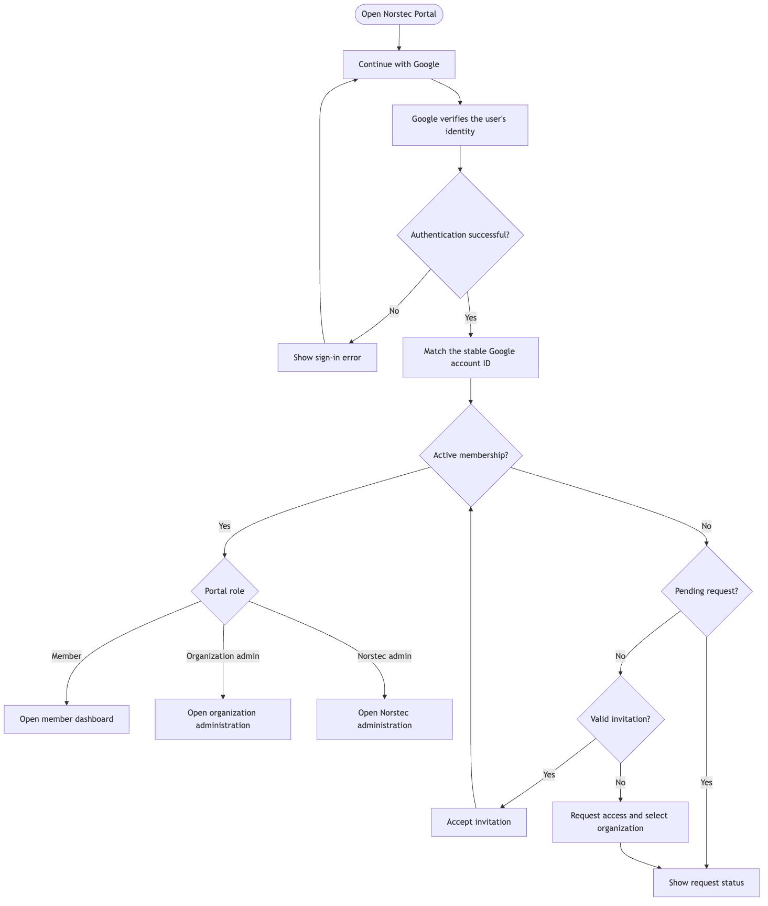
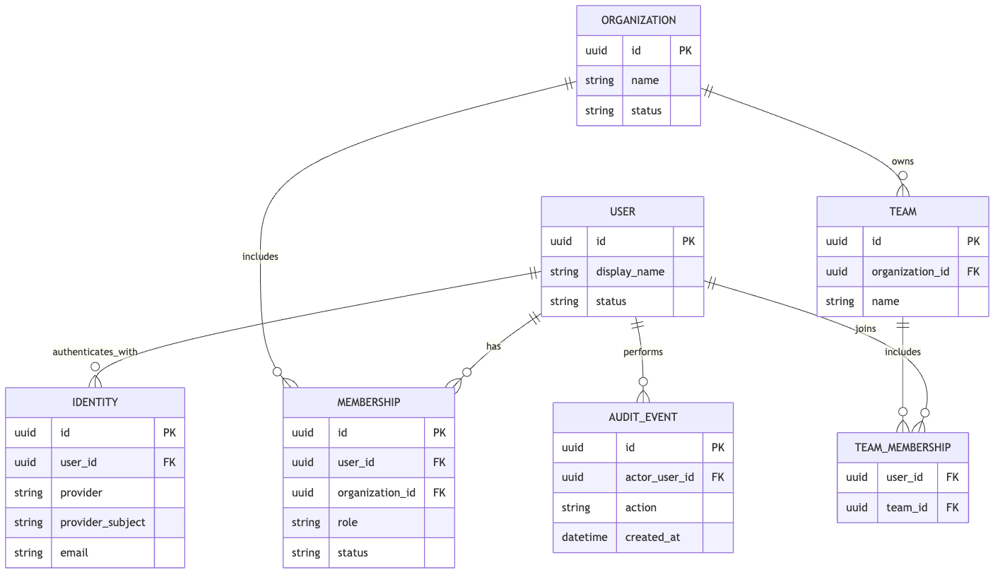

# Proposed architecture

This document describes a proposal, not a final decision.

## Application structure

The project should initially be one deployable Next.js application. Splitting
the frontend and backend into separate applications would add another build,
deployment, authentication boundary, and dependency lifecycle without solving a
current requirement.

Next.js Route Handlers and server-side modules can provide the backend-for-
frontend functionality while keeping server secrets and privileged operations
out of browser bundles.

```text
.
├── src/
│   ├── app/
│   │   ├── (auth)/
│   │   ├── (portal)/
│   │   └── api/
│   ├── components/
│   │   └── ui/
│   ├── lib/
│   └── server/
│       ├── auth/
│       ├── db/
│       ├── permissions/
│       └── services/
├── database/
│   └── migrations/
├── docs/
├── tests/
└── deploy/
```

A separate worker may be introduced if reliable Slack synchronization requires
a durable job queue. The membership database, not Slack, must remain the source
of truth.

## System context



## Authentication and membership flow



Google establishes identity only. PostgreSQL membership records determine portal
access and roles. A Google Workspace domain may help suggest an organization,
but it must not grant membership or an administrator role automatically.

## Conceptual data model



The diagram is intentionally conceptual. Columns and constraints will be
finalized after the membership lifecycle and permission rules are approved.

## Proposed technology choices

| Area | Proposal | Status |
| --- | --- | --- |
| Web application | Next.js App Router, React, TypeScript | Preferred |
| User interface | Tailwind CSS, shadcn/ui | Preferred |
| Validation | Zod | Proposed |
| Authentication | Google through an authentication provider | Provider undecided |
| Database | PostgreSQL | Preferred |
| Authorization | Membership tables plus PostgreSQL Row Level Security | Proposed |
| Unit testing | Vitest and React Testing Library | Proposed |
| End-to-end testing | Playwright | Proposed |
| Hosting | Docker on NTNU OpenStack | Preferred |
| HTTPS termination | NTNU-provided ingress or self-managed reverse proxy | Undecided |
| Automation | To be decided with the deployment design | Undecided |

## References

- [Next.js App Router](https://nextjs.org/docs/app)
- [Next.js Route Handlers](https://nextjs.org/docs/app/getting-started/route-handlers)
- [shadcn/ui for Next.js](https://ui.shadcn.com/docs/installation/next)
