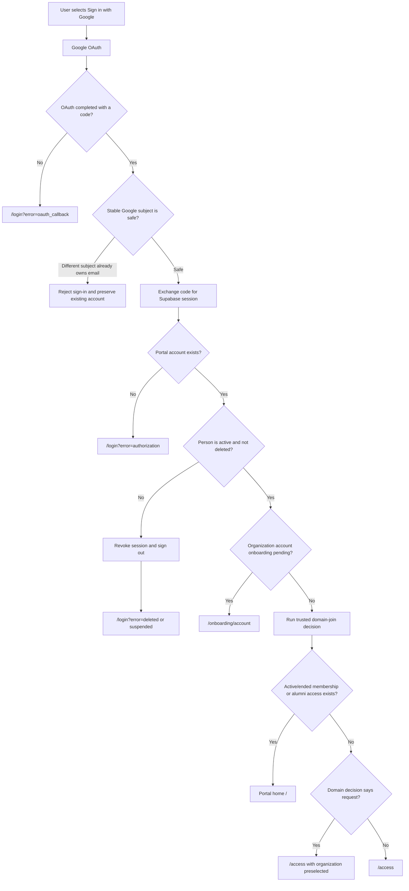
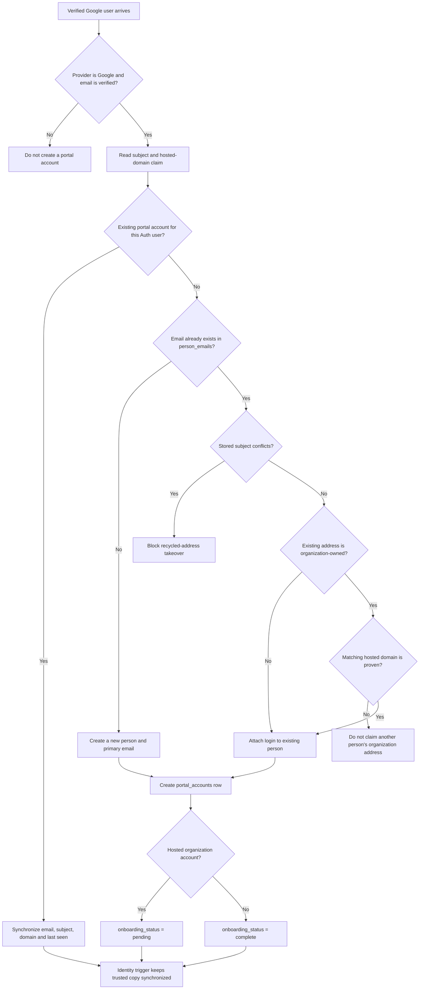
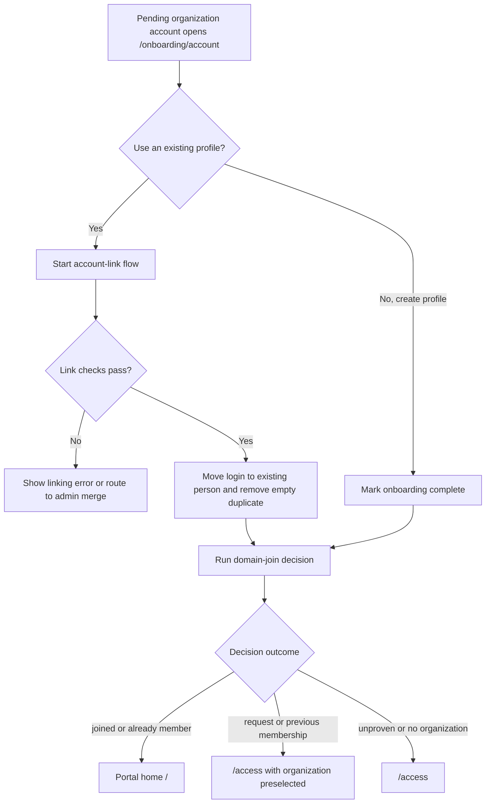
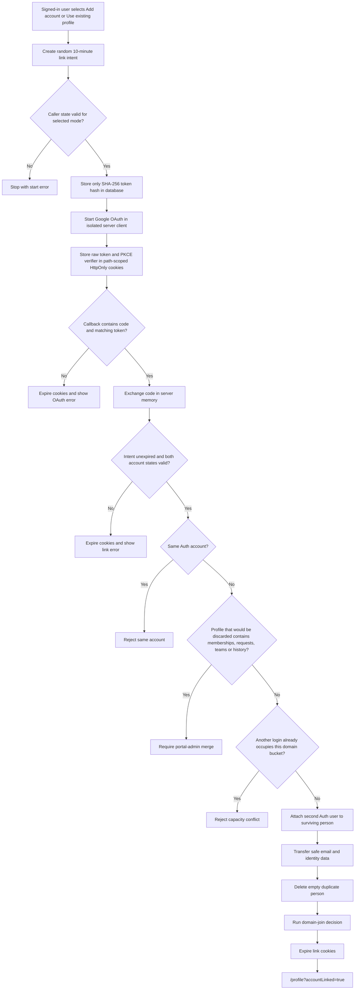
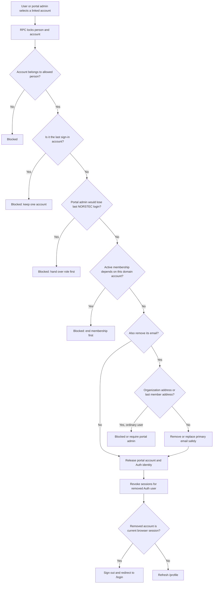
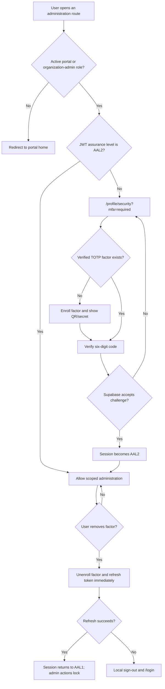

# Authentication and account flows

## Sign-in and destination

Covers `/login`, `/auth/callback`, `private.before_user_created`, the
`auth.identities` guards and `apply_own_domain_join`.

## First Google identity and profile provisioning

Provisioning runs inside the database when Supabase creates or updates a Google
user.

## First organization-account onboarding

## Link another Google account

This flow never replaces the browser's existing portal session.

## Unlink a Google account

## Administrator MFA elevation

