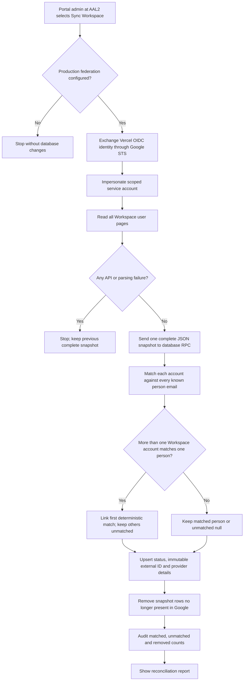
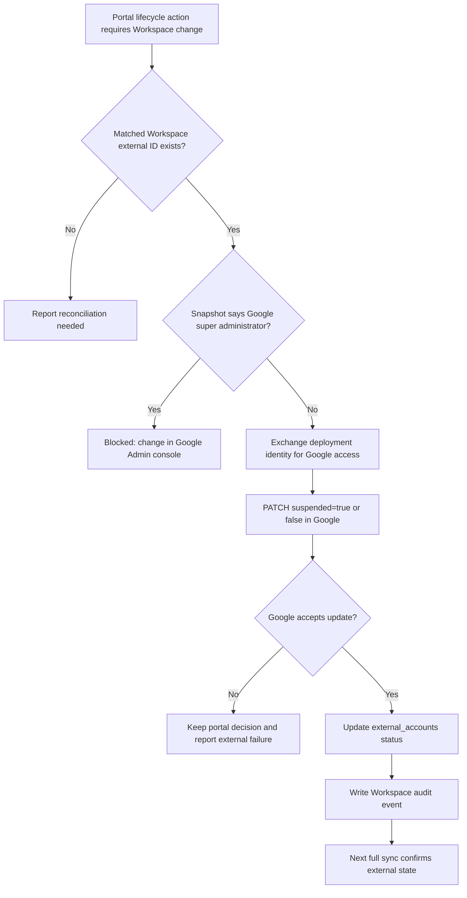
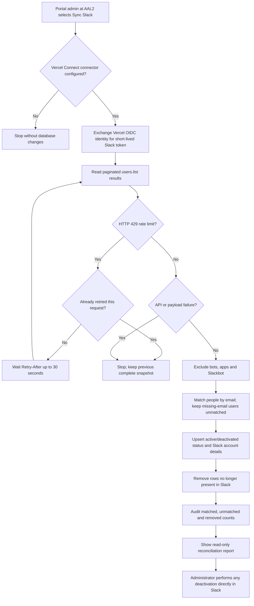
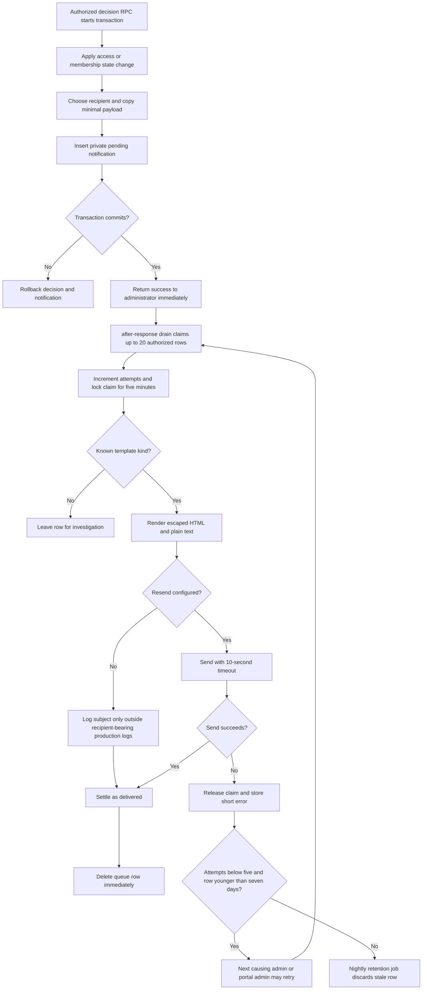

# Integration and notification flows

## Synchronize Google Workspace

The portal reads the complete directory before changing its database snapshot.

## Suspend or reactivate a Workspace account

This is the portal's only external account write.

## Synchronize Slack

Slack integration is read-only.

## Decision-email outbox

Approval, rejection and final-membership-ending decisions use the same queue.

