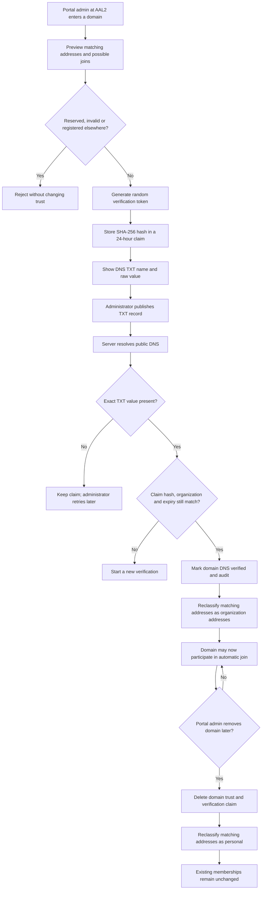
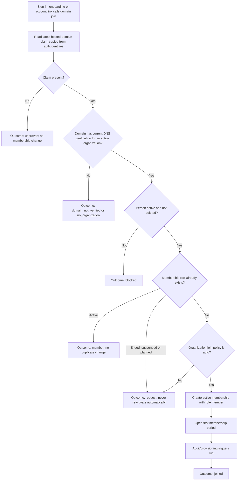
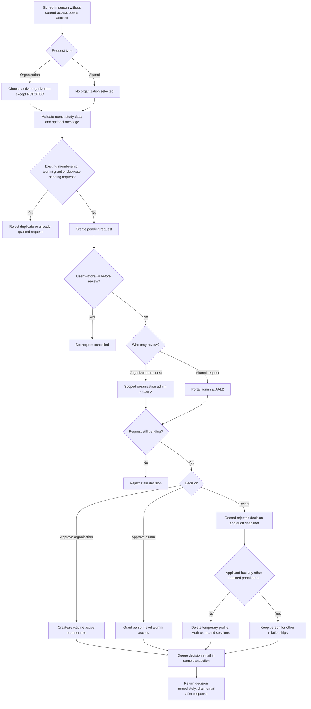
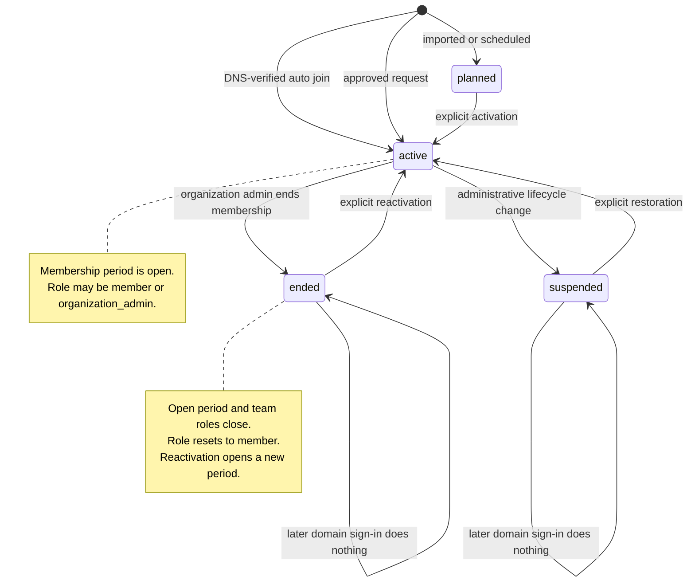
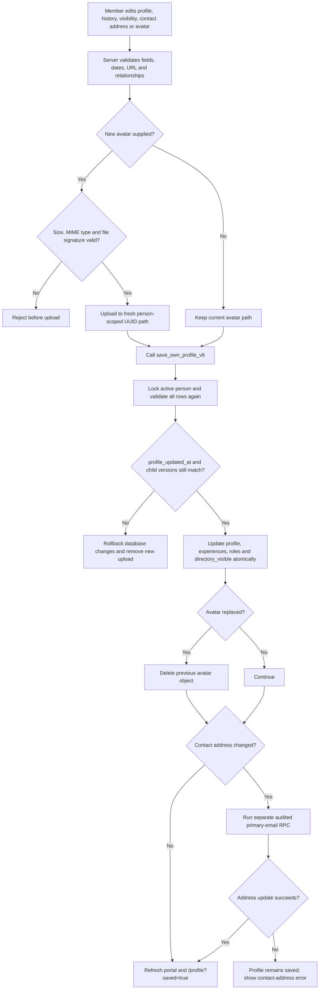
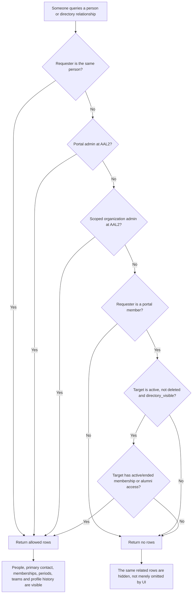
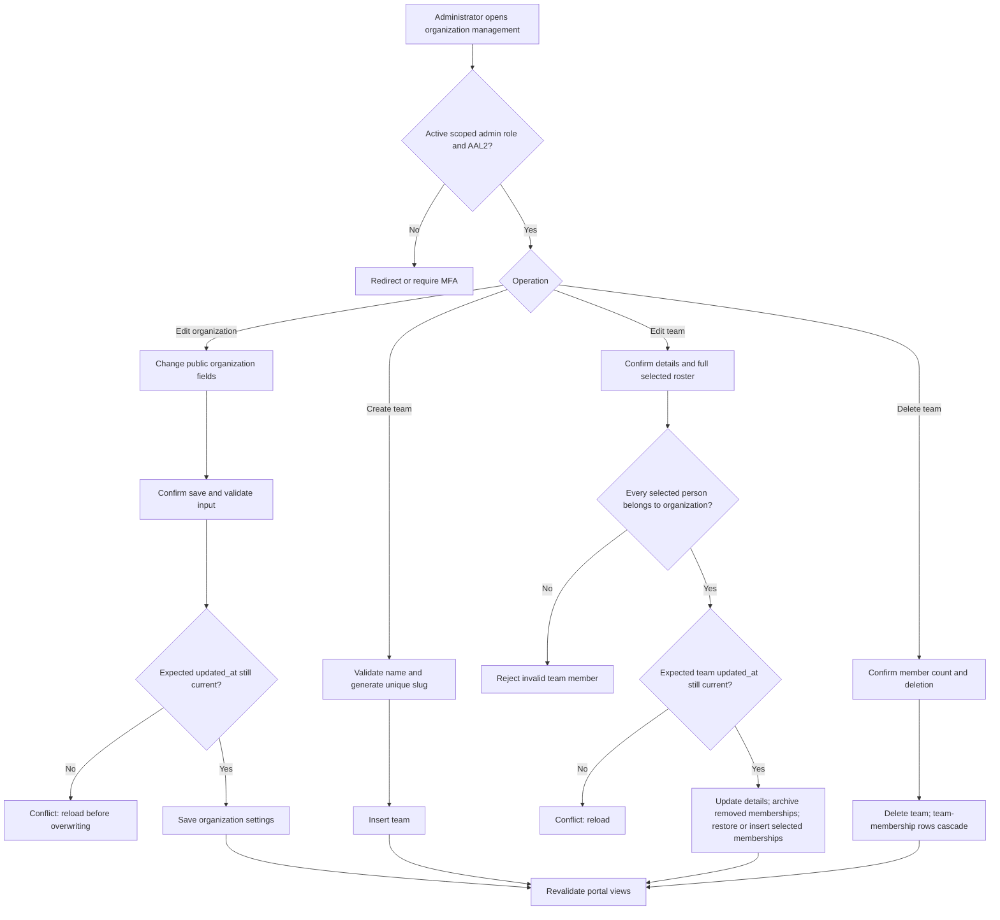

# Membership and directory flows

## Verify or remove an organization domain

Domain ownership is a portal-admin operation. It never approves individual
people.

## Automatic domain membership

The default organization policy is automatic joining. A previous membership
always outranks the domain rule.

## Access request and review

## Membership lifecycle

## Save own profile

## Directory visibility

Every related table applies the same person decision through RLS.

## Organization and team administration

