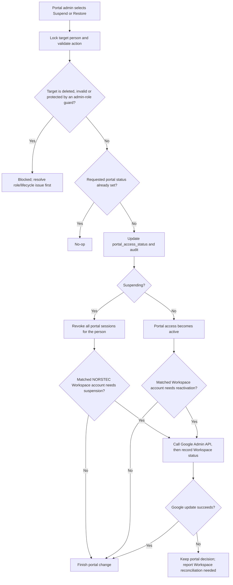
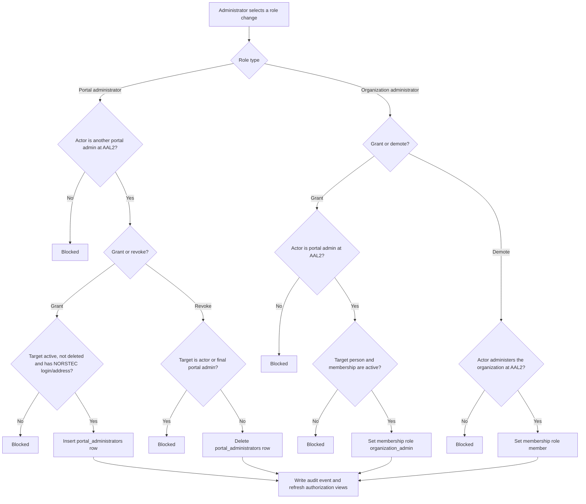
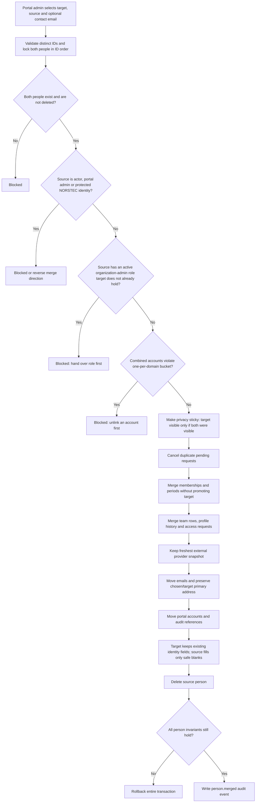
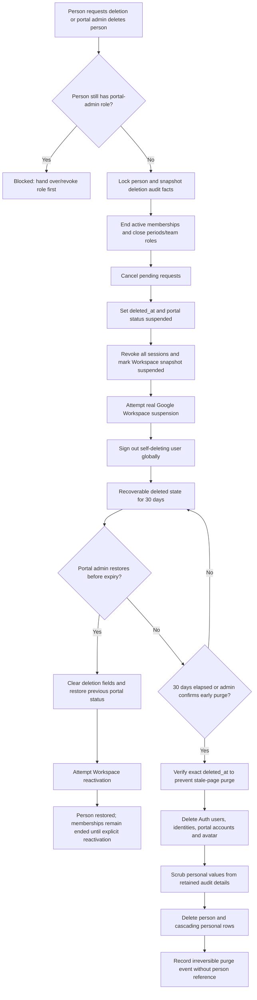
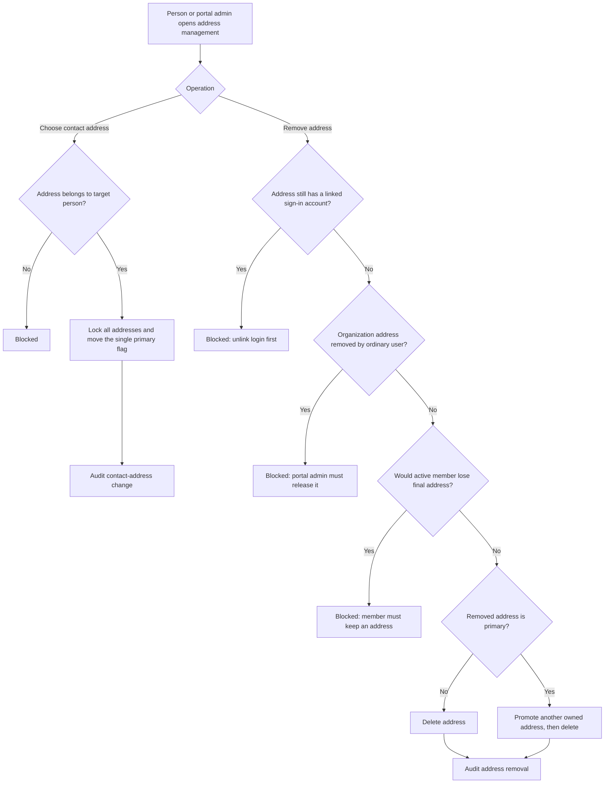

# Portal-administration flows

All flows in this document require a portal administrator with an AAL2 session
unless a branch explicitly says otherwise.

## Suspend or restore portal access

## Grant or revoke administrator roles

## Merge duplicate profiles

The target survives. The source is removed.

## Delete, restore or purge a person

## Select or remove a contact address

