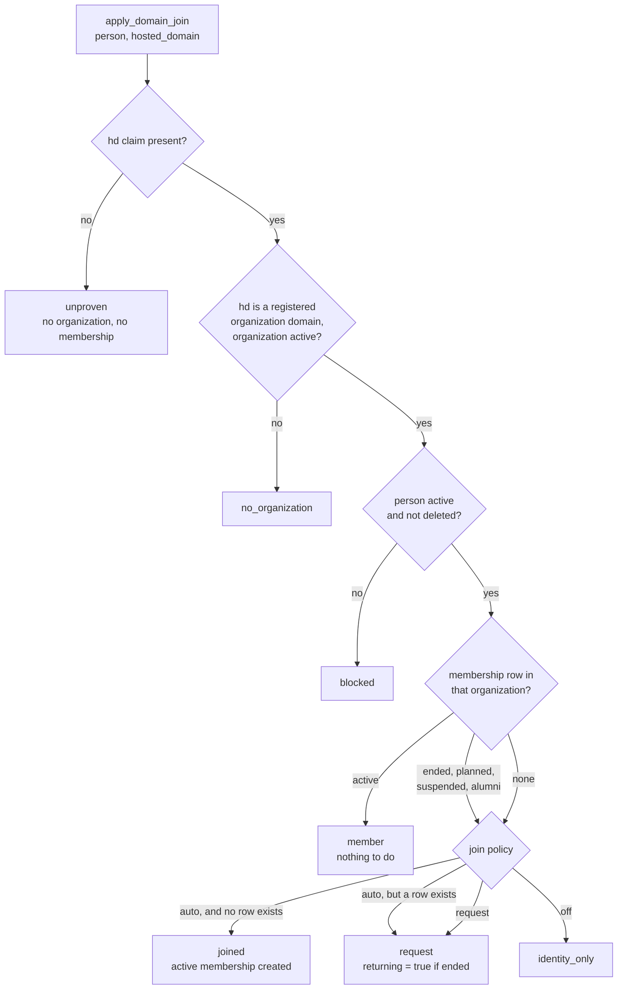
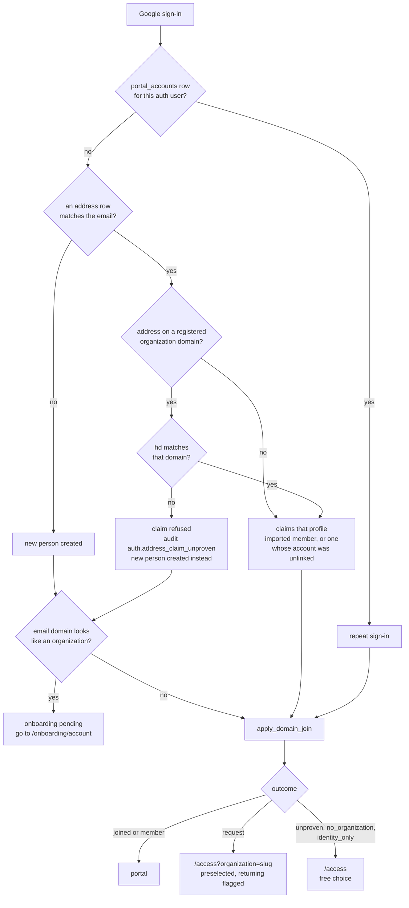
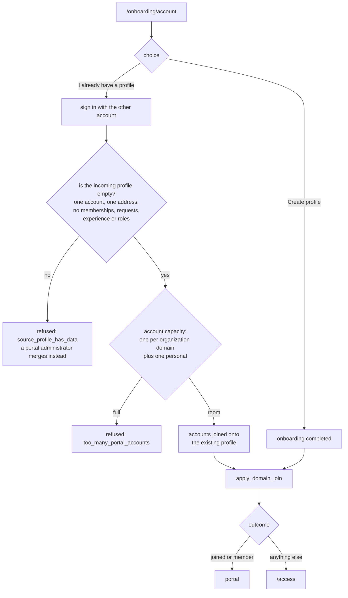
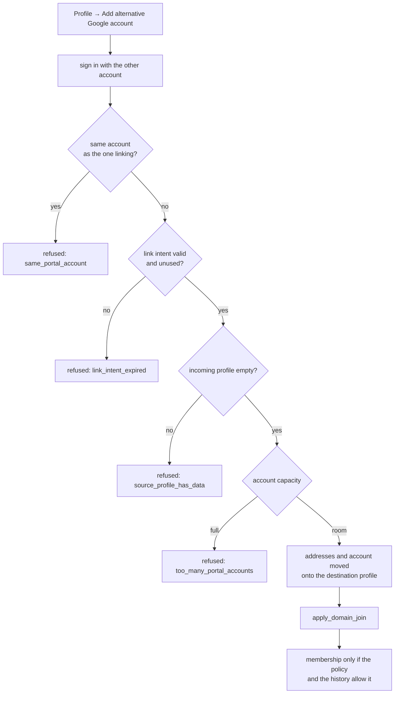
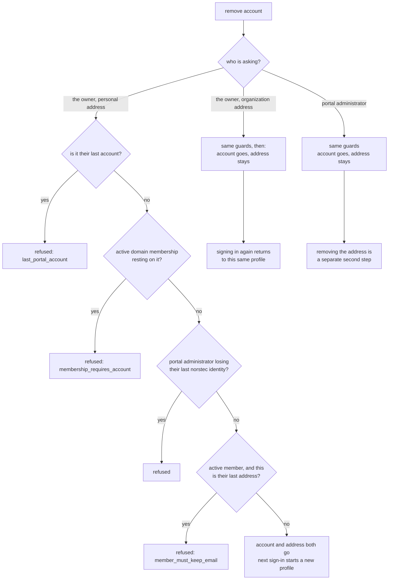
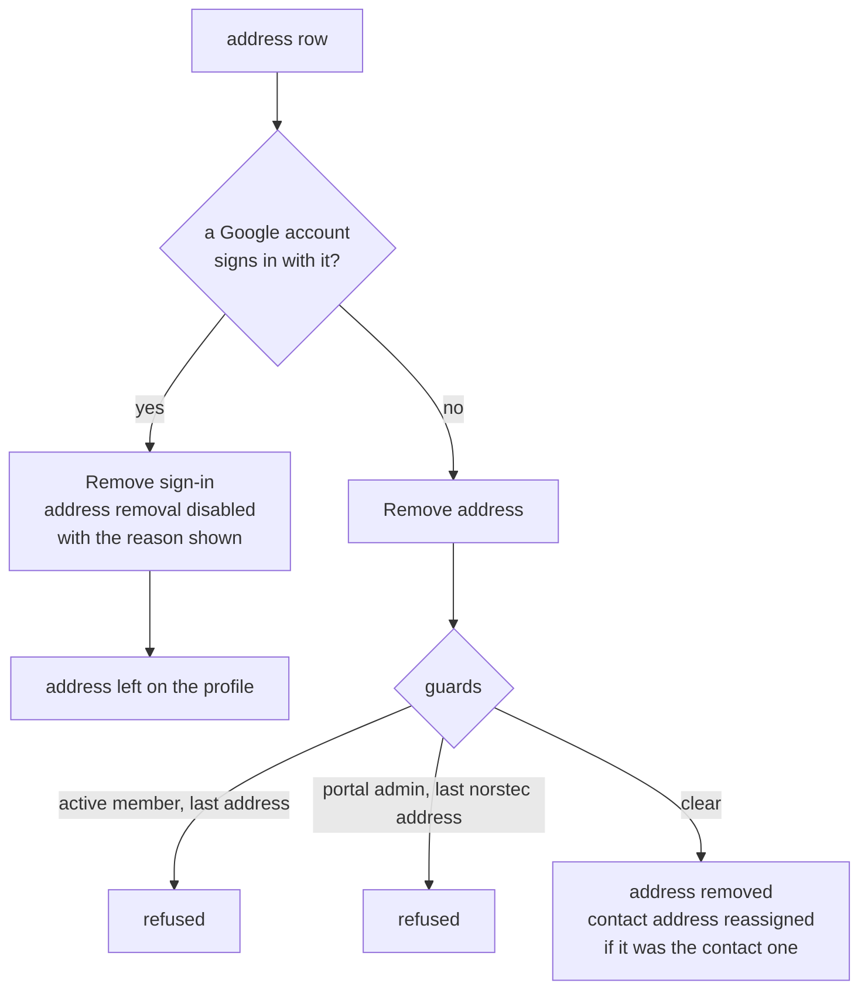
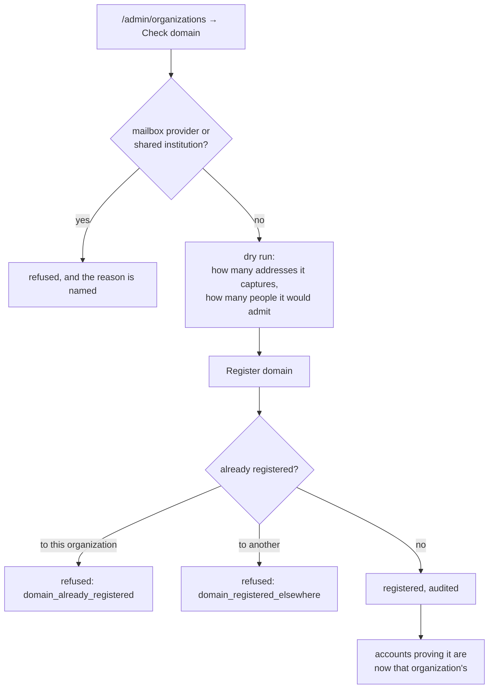

# Identity flows

Every path a Google account can take into the portal, and what decides what at
each fork. The design and the reasoning are in
[identity-model-plan.md](identity-model-plan.md); this is the map, and the
manual test script at the end walks it.

Read the first diagram before the others. Four different doors lead to it, and
it is the only place a domain membership is ever created.

## The one decision

`private.apply_domain_join(person, hosted_domain)`. Called from the sign-in
trigger, from the sign-in callback, from account linking, and from the
"Create profile" button — nowhere else inserts a membership with
`provisioning_method = 'domain'`.

Two rules inside it are worth stating on their own, because they are the ones
that look surprising from outside:

- **An absent `hd` means not proven, never proven personal.** GoTrue has a
  legacy path that drops the claim, so reading its absence as evidence would
  turn a Google hiccup into a portal-wide demotion.
- **Any membership row outranks the policy.** `ended` is the one that matters —
  somebody the organization has already let go does not walk back in because
  their Workspace account outlived the decision, which is the rule a SCIM
  directory enforces by not listing them. `planned`, `suspended` and `alumni`
  are equally not an invitation to insert, and equally cannot be reported as a
  join: the insert would do nothing while the caller was told a membership had
  been created.
- **An ended membership is not the same as no access.** Portal access follows
  the membership lifecycle, where an ended membership makes somebody an
  alumnus and keeps them in the portal — see
  [membership-lifecycle.md](membership-lifecycle.md). So a returning member
  signs in and lands in the portal as before; what they do not get is a fresh
  active membership in the organization that ended theirs. The returning-member
  wording on `/access` is reached only by somebody who has no portal access at
  all, which today means it is rarely seen.

## Signing in

The **repeat sign-in** arrow is the one that is easy to miss. The trigger on
`auth.users` fires on inserts and on changes to the email, its confirmation or
the app metadata — never on an ordinary sign-in. So the callback asks
`apply_own_domain_join` on every sign-in instead. Without it, a join policy
switched from `request` to `auto` would reach nobody until each person happened
to be renamed in the Admin console.

## Onboarding: is this a new person?

Reached when a brand new profile arrives on an address that looks like an
organization's.

## Linking a second account from the profile

Linking runs the same decision as signing in. Before that, it ran its own copy,
which meant an ended member refused at the sign-in door could link the same
account instead and be handed the membership that way.

## Removing a sign-in account

The split is the Okta and Entra one: a personal address is the person's own, a
directory-provisioned one is the organization's. The dialog says which it is
before anything happens.

## Administering addresses

On a person's administration page, one list, in the order the guards enforce.

## Registering a domain

Removing a domain leaves every membership it produced. Those are somebody's
actual standing, and ending them is a separate decision. The addresses become
ordinary personal addresses, which their owners may then remove themselves.

## Test script

Each row is something you can do by hand, in order within its group. The
identifiers match the edge-case table in
[identity-model-plan.md](identity-model-plan.md).

### Joining

| # | Do this | Expect |
|---|---|---|
| SI1 | Set an organization to **Join automatically**, register its domain, sign in with an account on it that has never been seen | Straight into the portal, active membership on the person's admin page, `provisioning_method` domain |
| SI2 | Same, with the organization on **Ask for approval** | `/access` with that organization preselected and a line saying it reviews who joins |
| SI3 | Same, on **Prove identity only** | `/access` with a free choice, no preselection |
| SI4 | End a member's membership, then have them sign in again with the organization account | They reach the portal — an ended membership makes them an alumnus, and that is unchanged. On their admin page the membership is still **ended**: the domain did not hand it back |
| SI4b | Same, but with their portal access suspended and then reactivated with no membership at all | `/access`, that organization preselected, wording says they were a member before |
| SI5 | Approve that request | The same membership row goes active again — check the person page shows one membership for that organization, not two |
| SI6 | Sign in again as an active member | Nothing changes |
| SI7 | Sign in with a personal Gmail nobody knows | New profile, `/access`, free choice of organization or alumni |
| SI8 | Import a person with an address, then sign in with the matching Google account | Claims the profile, keeps the history, status goes from unclaimed to active |
| SI10 | Hardest to stage: an account whose address is on a registered domain but which is **not** a Workspace account on it | New profile rather than the existing one, and `auth.address_claim_unproven` in the audit log |
| SI17 | Deactivate an organization, then sign in with an account on its domain | No membership, address still recorded |

### Re-evaluation

| # | Do this | Expect |
|---|---|---|
| RS1 | With somebody sitting on `/access` for an organization, switch it to **Join automatically**, then have them sign in again | They land in the portal. This is the one that does not work without the callback asking |
| RS3 | Switch an organization from auto to ask | Existing members keep everything; only new arrivals are gated |
| RS4 | End somebody's membership while they have a tab open | Their next page load drops them out of the portal |

### Linking

| # | Do this | Expect |
|---|---|---|
| LK1 | From the profile, add a personal Google account | Both accounts sign in to the same profile |
| LK2 | Add the organization account of an organization they are already an active member of | Linked, membership untouched, still says how they really got in |
| LK3 | With an ended membership, link that organization's account | Linked, no membership, sent to a request. **The bypass test** |
| LK6 | Try to link an account that already has a profile with data | Refused, pointing at a merge |
| LK8 | Try to link a second account on the same organization domain | Refused |
| LK11 | Start a link, wait for the intent to expire, finish it | Refused |

### Removing

| # | Do this | Expect |
|---|---|---|
| UL1 | Remove a personal account from the profile, then sign in with it again | Button says "Remove account and address". Afterwards it is a **new** profile asking for access |
| UL2 | Look at an organization account on the profile | Button says "Remove account", dialog says the address stays and points at portal@norstec.no |
| UL3 | Try to remove the only account | Refused |
| UL4 | Try to remove the organization account an active membership rests on | Refused, naming the membership |
| UL6 | As portal administrator, remove somebody's sign-in account | Account gone, address still listed, address removal now offered |
| UL7 | Have them sign in with that same account again | Back on the same profile — the address still names it |

### Administering

| # | Do this | Expect |
|---|---|---|
| PL6 | Try to remove the last norstec.no address of a portal administrator | Refused, telling you to revoke the role first |
| PL7 | Try to remove an address that still has a sign-in account | The button is disabled with the reason on the row, not an error afterwards |
| PL8 | Try to remove an active member's only address | Refused |
| DP2 | Try to register `gmail.com`, then `ntnu.no` | Both refused, each with its own reason |
| DP3 | Check a domain that several people already hold addresses on | The count is shown before you can register it |
| DP4 | Remove a domain that produced memberships | Memberships still there afterwards; the dialog said so |
| MG2 | Try to merge two profiles that each hold an account on the same domain | Refused, telling you to unlink one first |

### Known and accepted

Not bugs. Written down so they are not rediscovered as bugs.

| # | Behaviour | Why it stays |
|---|---|---|
| DS2 | A Workspace account whose address a previous holder still has on file matches that person until the new holder signs in | Address recycling does not happen at Norstec in practice; the fix is one line in `sync_workspace_directory` if it ever does |
| CR1 | Signing in with two organization accounts before linking either produces two profiles | Nothing can tell they are one person until somebody says so. This is what merge is for |
| CR3 | Gmail dot and plus variants count as different addresses | Google normalises them, the portal does not, so the same person can end up with two profiles without anybody making a mistake |
| CR4 | A shared or role account can be linked to a person | Detecting one needs the organization's Workspace directory, which the portal cannot read for anyone but Norstec |
| SI11 | An account that could not claim an imported profile leaves both profiles in place | Surfaced through the audit event rather than prevented, because the portal cannot tell which of the two is the real person |
