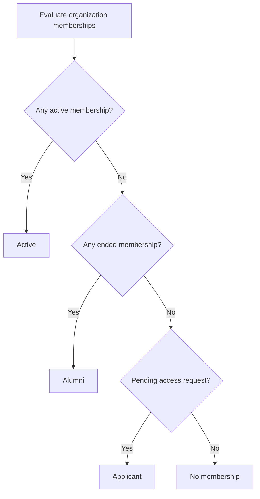
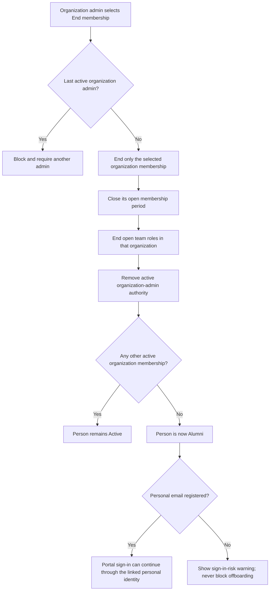
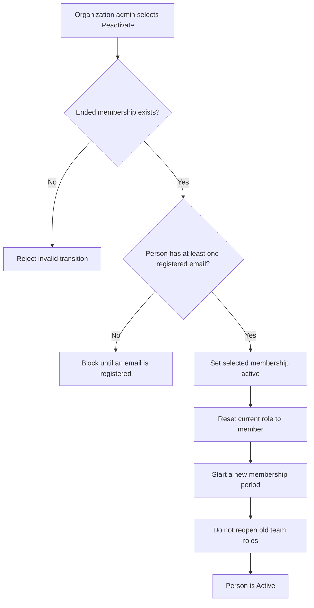
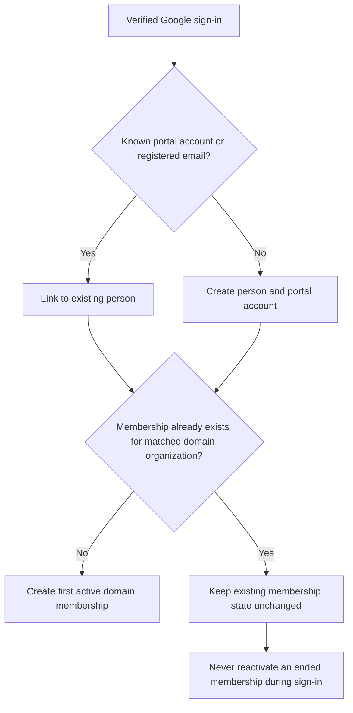
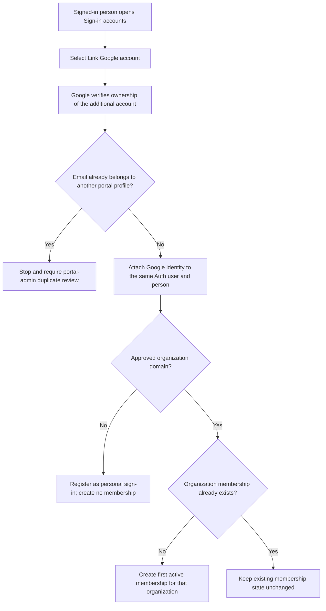
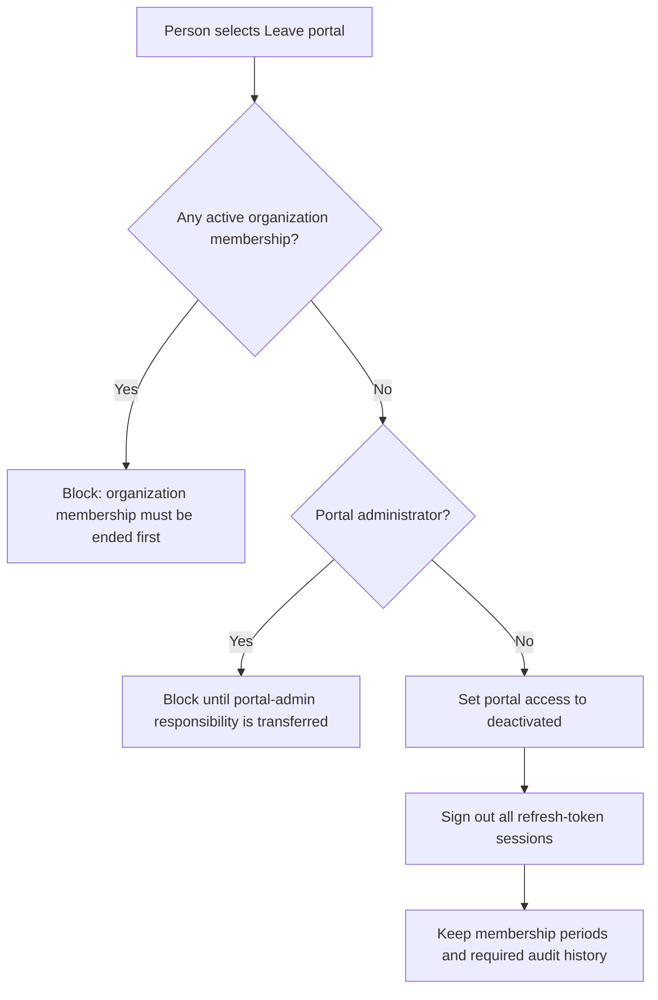

# Membership lifecycle

This document is the source of truth for membership, alumni, portal access, and
offboarding behavior. Product copy and authorization tests must follow these
rules.

## Concepts

- A **person** is the long-lived Norstec profile.
- An **organization membership** belongs to exactly one person and one
  organization. Its current state is `active` or `ended` in the member-facing
  product.
- A **membership period** preserves every separate active interval. Reactivation
  starts a new period instead of rewriting old history.
- **Alumni** is a derived person-level label: no active organization memberships
  and at least one ended organization membership.
- **Portal access** is separate from membership. Alumni keep ordinary portal
  access until they choose `Leave portal` or a portal administrator suspends it.

## Derived person status

The `Active` and `Alumni` labels above do not replace account status. A person
can be an alumnus while portal access is enabled, suspended, or deactivated.

## Ending an organization membership

Ending a membership must never depend on the person having a personal email.
No notification email is sent while the portal is in its test phase. A future
notification should be advisory and must not become a database precondition.

## Reactivation

Reactivation affects only the selected organization. Former admin permissions
and team roles are historical and require explicit new assignments.

## Domain account behavior

Organization lifecycle is controlled by administrators, not by later changes
to an authentication identity or email domain.

## Linking another Google account

Both active members and alumni may link a personal Google account. Linking it
while the organization account still works is the recommended offboarding
preparation. A personal account is authentication only and never grants an
organization membership.

An unknown account must not be matched by name or email similarity. The sign-in
page tells existing users to sign in with an already linked account first and
then link the new account from their profile. Duplicate people that already
exist require a separate portal-admin repair workflow.

For every deployed Supabase environment, manual identity linking and the
`/auth/link-callback` redirect must be enabled. During the test phase, the
`identity linked` and `identity unlinked` security notification templates must
remain disabled so the flow sends no email.

## Leaving the portal

`Leave portal` is not GDPR erasure. Re-enabling a deactivated account requires a
controlled administrator process. Full erasure is a separate portal-admin
workflow that must handle Auth identities, Storage objects, personal profile
data, legal retention, and audit anonymization together.

## Edge-case decisions

| Edge case | Required behavior |
| --- | --- |
| Person belongs to several organizations | Ending one membership leaves the others active. |
| Last active membership ends | Person becomes Alumni and retains portal access. |
| Ended organization membership is reactivated | Only that organization is activated; a new period starts. |
| Former organization admin is reactivated | Role is `member`; admin must be assigned again. |
| Open team roles exist | They end on the membership end date and never reopen automatically. |
| Only organization email exists | Ending is allowed; UI warns about future sign-in risk. |
| Active member links a personal Google account | Allow it as a backup sign-in; create no membership. |
| Person links a second approved organization account | Keep one person and create only the missing organization membership. |
| Linked domain membership already ended | Keep it ended; identity linking never reactivates it. |
| Linked email belongs to another profile | Block linking and require controlled duplicate review. |
| Existing user arrives with an unknown account | Instruct them to sign in with an existing account and link it from Profile. |
| Alumni wants a future membership | No alumni application flow in the current release. |
| Domain user signs in after being ended | Sign-in must not reactivate the membership. |
| Last active organization admin is ended | Block until another active organization admin exists. |
| Portal administrator manages an organization | Portal-admin authority remains system-wide and separate. |
| Organization is archived | Active memberships require an explicit bulk transition plan; never silently delete history. |
| Repeated or concurrent status action | Lock the membership row and make identical transitions idempotent. |
| Ordinary admin selects Delete | Hard deletion is unavailable; use End membership. |
| Person wants to leave the portal | Deactivate portal access after all active memberships have ended. |
| Person requests GDPR erasure | Use a separate global workflow; never treat membership deletion as erasure. |
