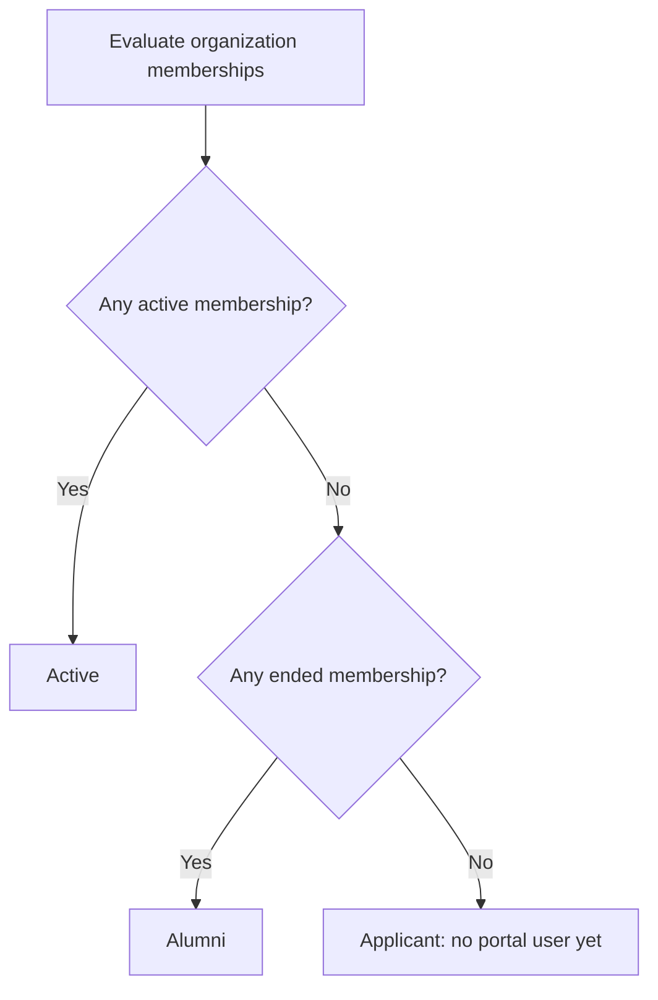
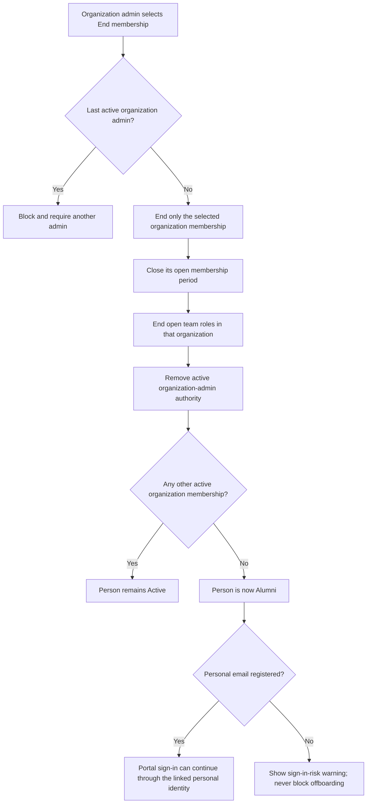
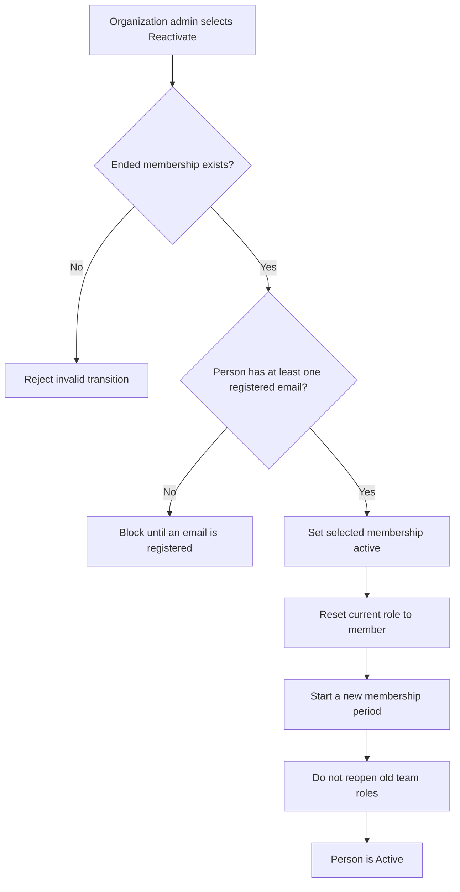
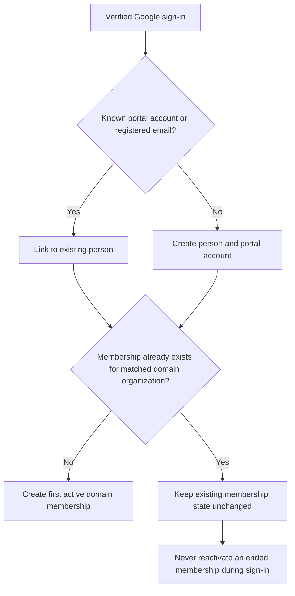
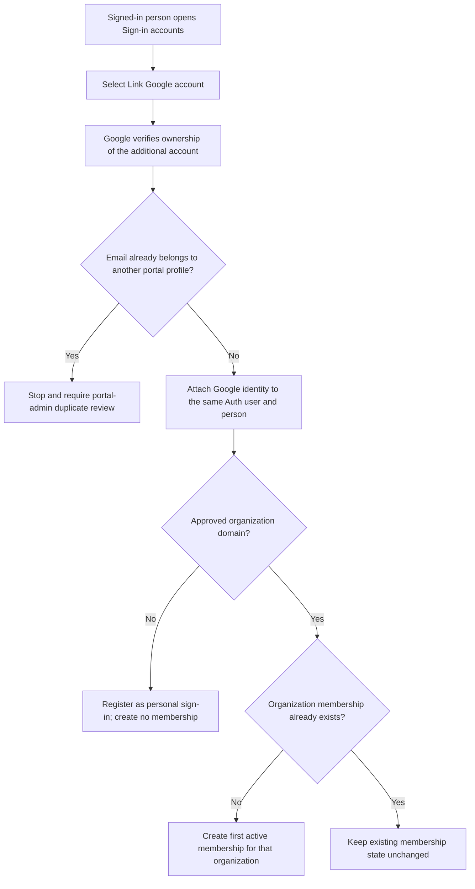
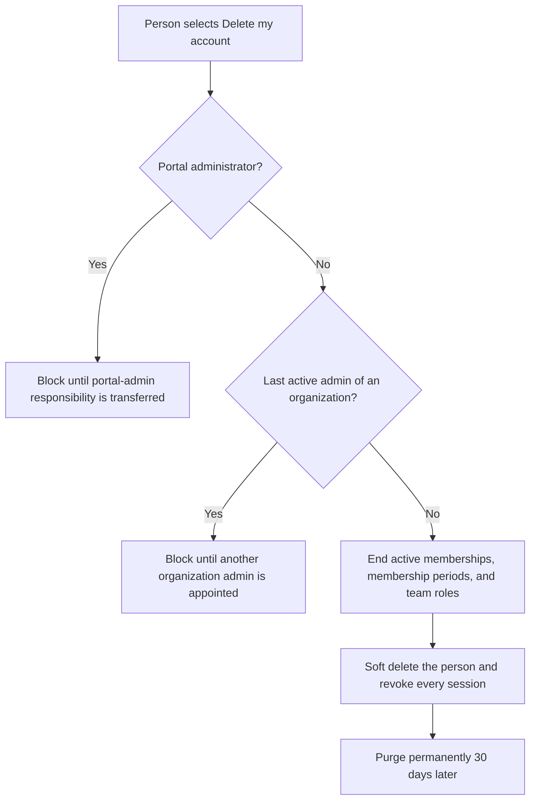
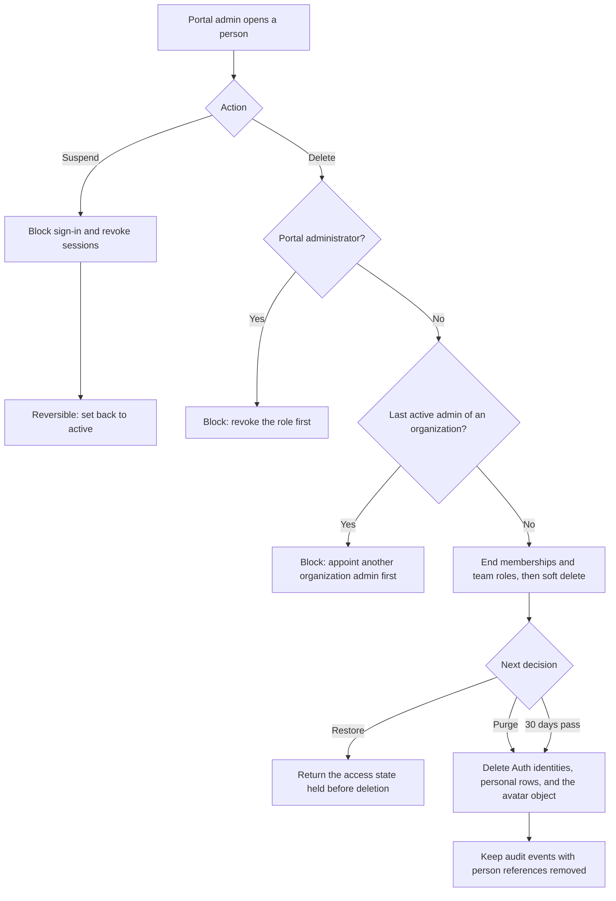

# Membership lifecycle

This document is the source of truth for membership, alumni, portal access, and
offboarding behavior. Product copy and authorization tests must follow these
rules.

## Concepts

- A **person** is the long-lived Norstec profile.
- An **organization membership** belongs to exactly one person and one
  organization. Its current state is `active` or `ended` in the member-facing
  product.
- A **membership period** preserves every separate active interval. Reactivation
  starts a new period instead of rewriting old history.
- **Alumni** is a derived person-level label: no active organization memberships
  and at least one ended organization membership.
- **Portal access** is separate from membership. Alumni keep ordinary portal
  access until a portal administrator suspends it or the person deletes their
  own account.

## Derived person status

Only `Active` and `Alumni` describe a user of the portal. A person with no
membership at all is an applicant whose request is still waiting or was
declined, and a declined request takes the profile with it, so the state is
never a resting place.

The `Active` and `Alumni` labels do not replace account status. A person can be
an alumnus while portal access is enabled or suspended.

## Ending an organization membership

Ending a membership must never depend on the person having a personal email.
No notification email is sent while the portal is in its test phase. A future
notification should be advisory and must not become a database precondition.

## Reactivation

Reactivation affects only the selected organization. Former admin permissions
and team roles are historical and require explicit new assignments.

## Domain account behavior

Organization lifecycle is controlled by administrators, not by later changes
to an authentication identity or email domain.

## Linking another Google account

Both active members and alumni may link a personal Google account. Linking it
while the organization account still works is the recommended offboarding
preparation. A personal account is authentication only and never grants an
organization membership.

Unlinking removes the sign-in account and releases the Google user, so the
account can start over somewhere else. The **address stays on the profile**: it
is a fact about the person, not a lease held open by a Google account, and it
is how the portal recognises them if they sign in with that account again —
which is why doing so returns them to their own profile rather than minting a
new one with a fresh membership. Deleting an address is a separate
portal-administrator action, for when the address has genuinely been handed to
somebody else.

An unknown account must not be matched by name or email similarity. The sign-in
page tells existing users to sign in with an already linked account first and
then link the new account from their profile. Duplicate people that already
exist require a separate portal-admin repair workflow.

For every deployed Supabase environment, manual identity linking and the
`/auth/link-callback` redirect must be enabled. During the test phase, the
`identity linked` and `identity unlinked` security notification templates must
remain disabled so the flow sends no email.

## Contact address

Every person has exactly one contact address: the address the member directory
shows, and the only address the portal presents to other members. It is
presentation, not authorization — nothing is granted or withdrawn by moving it,
because authorization reads memberships and sign-in accounts — so the person
sets it themselves, choosing among the addresses already registered on their
profile. A portal administrator can set it for somebody who cannot.

This matters most to alumni. An organization address usually stops working
shortly after the membership ends, and before it could be moved, the directory
went on showing an address nobody could reach.

A person holding any address always has exactly one contact address. Removing
the current one promotes another rather than leaving the person unreachable,
and the database enforces it rather than trusting each writer to remember.

## Identity and Google accounts

A Google account is identified by its subject identifier, not by its address.
Addresses change: renaming somebody in the Admin console moves the address on
their profile rather than adding a second one, so the contact address follows
the rename and the old address is released instead of being held forever.

An address that has been proved by a Google account records which one. A
*different* Google account presenting the same address is therefore not treated
as the same person — that is an address the Admin console has reassigned, and
matching on it would hand the new holder the previous holder's profile. They
get their own profile and the reuse is recorded for a portal administrator.

## Deleting your own account

Portal access has exactly two states a person can be in: they can sign in, or
they cannot. There is no separate self-service state that only disables
sign-in — a person asking to leave is asking to be deleted, and GDPR requires
that erasure actually happens. Deleting is therefore the only self-service
exit, and it is the same operation a portal administrator runs, on the same
30-day retention.

The 30 days are a recovery window, not a review queue. Restoring within them
requires a portal administrator, so the interface tells the person to email
portal@norstec.no. Restoring returns the person and their portal access;
memberships that ended with the deletion stay ended, because reactivating one
is the organization's decision and starts a new period.

Erasure is enforced by a scheduled database job rather than by an
administrator remembering, and it removes Auth identities, personal rows, and
the avatar object. Audit events survive with every reference to the person
removed.

## Portal management

Suspending access, deleting a person, purging their data, merging duplicate
profiles, moving somebody's contact address, releasing a reassigned address,
and unlinking a sign-in account on somebody's behalf exist only in Portal
management and only for portal administrators.
Organization administration stops at membership state.

Deletion is deliberately two stages. GDPR requires erasure without undue delay,
not in the same transaction as the decision, so the reversible stage is safe and
gives a recovery path for a mistaken deletion. Purging is irreversible and names
the exact deletion it finishes, so a stale page cannot purge somebody who was
restored in the meantime.

`Manage users` lists a person only once they hold, or have held, an
organization membership, plus every portal administrator. A profile that a
Google sign-in created but that never led to a membership belongs to `Access
review`, not to the user table: while the request waits it is a request, and
declining it deletes the profile, its emails, and its Google sign-in outright.
The audit event is the only thing a declined request leaves behind. The
table states one access level per person: portal admin, organization admin,
member, or suspended. `Deleted users` is the separate list of people inside
the 30-day recovery window.

Merging keeps the target profile and folds the duplicate into it, including its
contact address: the surviving person keeps the address they already answered
on unless the administrator chooses otherwise in the merge dialog. Everything
else moves — emails,
sign-in accounts, memberships and their periods, team roles, requests, profile
experiences, and audit history all move, and two memberships in one organization
become one that keeps the live state and every separate period. A merge never
promotes a membership role; roles are only ever assigned by an explicit,
audited operation.

A portal administrator is never the duplicate being folded in. `merge_people`
rejects a source that holds the role, and the administrator is left out of the
duplicate picker, because the source profile is the one that disappears — a
portal-wide role must not end as a side effect of a duplicate repair. Merging
in the other direction is unrestricted: a duplicate folded into a portal
administrator leaves the administrator as the surviving profile, role intact.

## Edge-case decisions

| Edge case | Required behavior |
| --- | --- |
| Person belongs to several organizations | Ending one membership leaves the others active. |
| Last active membership ends | Person becomes Alumni and retains portal access. |
| Ended organization membership is reactivated | Only that organization is activated; a new period starts. |
| Former organization admin is reactivated | Role is `member`; admin must be assigned again. |
| Open team roles exist | They end on the membership end date and never reopen automatically. |
| Only organization email exists | Ending is allowed; UI warns about future sign-in risk. |
| Active member links a personal Google account | Allow it as a backup sign-in; create no membership. |
| Person links a second approved organization account | Keep one person and create only the missing organization membership. |
| Linked domain membership already ended | Keep it ended; identity linking never reactivates it. |
| Linked email belongs to another profile | Block linking and require controlled duplicate review. |
| Duplicate profiles are confirmed | A portal admin merges them; the surviving profile keeps its own fields and role. |
| One duplicate is a portal administrator | Only the merge that keeps the administrator is allowed; folding one in is blocked. |
| Existing user arrives with an unknown account | Instruct them to sign in with an existing account and link it from Profile. |
| Alumni wants a future membership | No alumni application flow in the current release. |
| Domain user signs in after being ended | Sign-in must not reactivate the membership. |
| Last active organization admin is ended | Block until another active organization admin exists. |
| Portal administrator manages an organization | Portal-admin authority remains system-wide and separate. |
| Organization is archived | Active memberships require an explicit bulk transition plan; never silently delete history. |
| Repeated or concurrent status action | Lock the membership row and make identical transitions idempotent. |
| Ordinary admin selects Delete | Hard deletion is unavailable; use End membership. |
| Person wants to leave the portal | Deactivate portal access after all active memberships have ended. |
| Person requests GDPR erasure | Use Portal management: delete, then purge; never treat membership deletion as erasure. |
| Deleted person is still needed | Restore returns the access state held before the deletion, until the data is purged. |
| Purged person appears in the audit log | The event stays; its person references are null and personal fields are stripped. |
| Alumnus keeps an organization contact address | They set a personal address as their contact address themselves; the directory follows it everywhere. |
| Merge would change the survivor's contact address | It never does by default; the administrator chooses explicitly in the merge dialog. |
| Workspace renames somebody | The address moves on the profile, the contact address follows, and the old address is released. |
| Reassigned address is used by a new employee | They get their own profile; the address stays with its holder and the reuse is recorded. |
| Unlinked account signs in again | It returns to the same profile; an ended membership stays ended. |
| Duplicate holds a third sign-in account | A portal administrator unlinks one on their behalf, then merges. |
| Portal administrator loses their Norstec account | They cannot unlink the last one themselves; Portal management lists any who no longer hold one. |
| Membership arrives while a request is pending | The request it answers is cancelled rather than left in the queue. |
