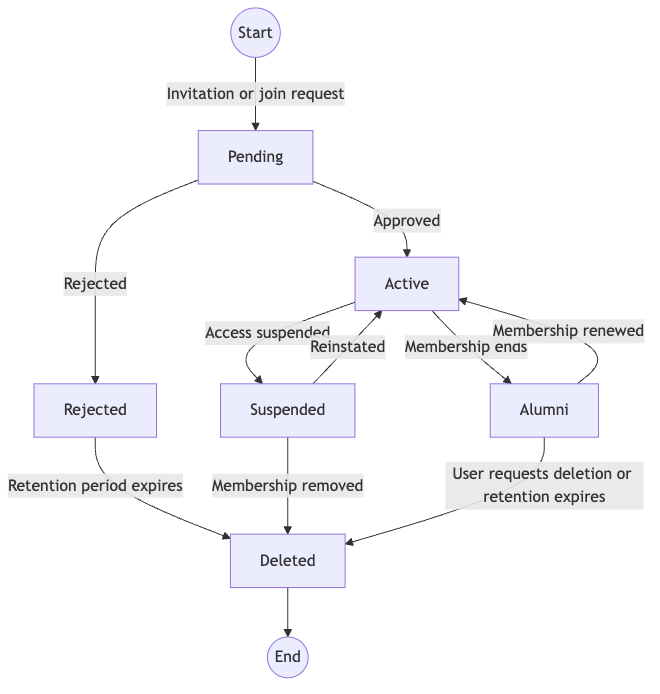

# Product scope

## Purpose

The portal will provide Norstec with one authoritative system for membership,
roles, teams, alumni transitions, and access to connected services.

## Initial users

- Members of Norstec member organizations
- Member-organization administrators
- Norstec administrators
- Alumni with limited access

## Membership lifecycle

## Proposed first release

- Sign in with Google
- Invite or request membership
- Review and approve membership requests
- View and update a personal profile
- Manage organizations, teams, and roles
- Transition a member to suspended, alumni, or deleted status
- Synchronize approved membership changes with Slack
- Record administrative and integration events in an audit log

## Explicit non-goals for the first release

- Membership-fee payments
- Vipps integration
- Expense reimbursement
- Annual-meeting administration
- Advanced alumni tracking
- Offering the portal as a product to member organizations

## Open product questions

- Who may approve and terminate a membership?
- Can one person belong to multiple organizations or teams?
- Which profile fields are required, optional, and visible to other members?
- What access should alumni retain?
- How long should inactive and alumni data be stored?
- Which Slack channels follow each role or team?
