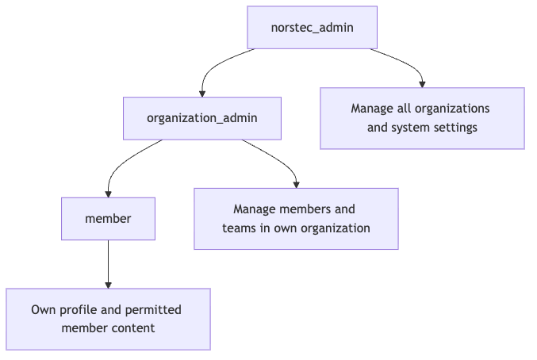

# Security model

This is an initial security model. It must be reviewed alongside the data model,
privacy assessment, and threat model before production data is introduced.

## Identity, membership, and authorization

These are separate concepts:

1. Google authenticates the person.
2. The portal stores an internal user profile.
3. An active membership connects the user to an organization.
4. Membership and system roles determine what the user may access.

A successful Google sign-in must not automatically grant access to member data.
An authenticated user without an active membership may only access onboarding.

Workspace domains may help suggest or verify an organization, but must never
grant an administrative role automatically.

## Proposed roles

- `member`
- `organization_admin`
- `norstec_admin`

Organization-scoped roles and global Norstec roles should be represented
separately in the data model.

## Role scope

[Mermaid source](diagrams/role-scope.mmd)

The arrows represent additional permissions, not automatic role assignment.
Roles must always be assigned through an authorized and audited operation.

| Capability | `member` | `organization_admin` | `norstec_admin` |
| --- | ---: | ---: | ---: |
| View and edit own profile | Yes | Yes | Yes |
| View permitted member content | Yes | Yes | Yes |
| Manage members in own organization | No | Yes | Yes |
| Manage teams in own organization | No | Yes | Yes |
| Manage other organizations | No | No | Yes |
| Assign administrator roles | No | No | Yes |
| Access system-wide audit information | No | No | Yes |

## Authorization rules

- Roles are stored in trusted database tables, not browser state or user-editable
  authentication metadata.
- Every table containing member data uses Row Level Security.
- Organization access is enforced in the database, not only through user-
  interface filtering.
- Sensitive mutations are checked both by the database policy and server-side
  permission functions.
- Privileged service credentials are never included in browser bundles.
- Global administrator roles are assigned manually and audited.
- Administrative access requires an additional authentication factor.

## Data and environment rules

- Do not use production personal data in local, test, or preview environments.
- Do not commit credentials, tokens, member exports, or environment files.
- Store only personal data with a documented purpose and retention rule.
- Do not log access tokens, session tokens, secrets, or unnecessary personal
  data.
- Keep development, staging, and production environments separate.

## Reliability and integrations

- The membership database is the source of truth.
- Slack synchronization must be asynchronous, idempotent, retryable, and
  auditable.
- A failed Slack request must not corrupt the membership state.
- Destructive bulk actions require confirmation, authorization, and a recovery
  plan.
- Production requires monitored backups and a tested restore procedure.

## Remaining design work

Before implementation is considered production-ready, the project needs:

- A personal-data register
- A detailed data-flow diagram
- A threat model and risk register
- An incident-response procedure
- Backup and restore procedures
- Administrator and project handover procedures
